# Wazuh Server Setup

## Environment
- OS: Ubuntu
- Wazuh version: 4.14.7
- Server IP: `192.168.33.137`
- Deployment type: Single-node (all components on one host)

## 1. Configuration File (`config.yml`)

Defined the indexer, server, and dashboard nodes, all pointing to the same IP for a single-node deployment.

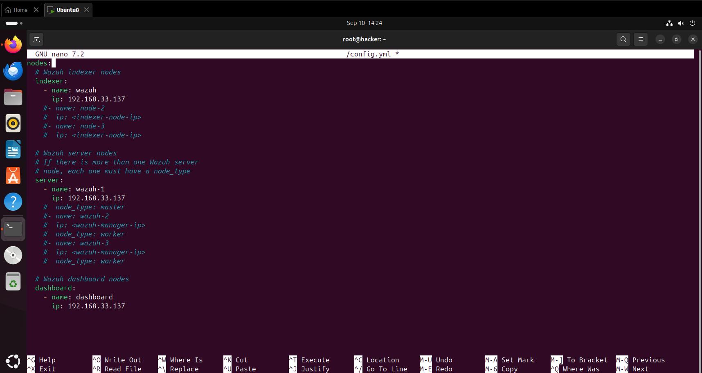

## 2. Certificate Generation

Generated the certificates using the Wazuh certificates tool:
```bash
bash ./wazuh-certs-tool.sh -A
```

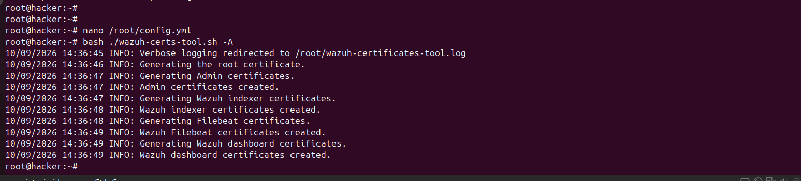

## 3. Certificate Deployment

Extracted and moved the generated certificates into the indexer's certs directory, then set correct ownership and permissions:
```bash
tar -xf /root/wazuh-certificates.tar -C /etc/wazuh-indexer/certs/ ...
chmod 500 /etc/wazuh-indexer/certs
chown -R wazuh-indexer:wazuh-indexer /etc/wazuh-indexer/certs
```

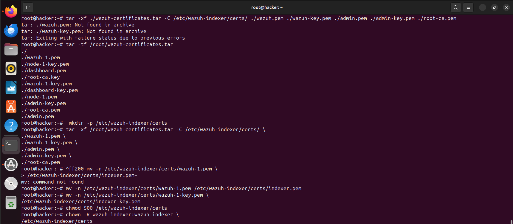

## 4. Wazuh Indexer Configuration

Edited `/etc/wazuh-indexer/opensearch.yml` to set the network host, node name, and certificate paths.

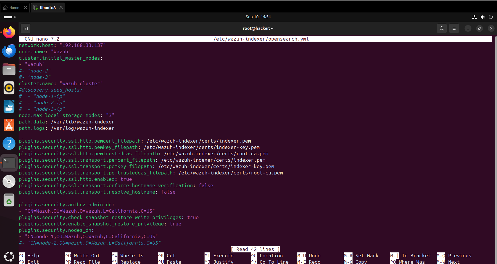

Started and enabled the indexer service:
```bash
systemctl daemon-reload
systemctl enable wazuh-indexer
systemctl start wazuh-indexer
systemctl status wazuh-indexer
```

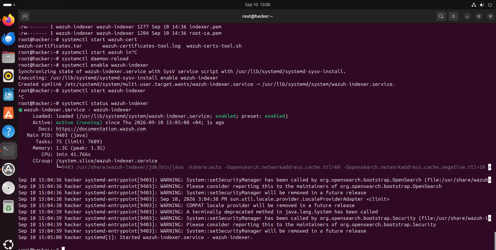

## 5. Security Admin Initialization

Ran the OpenSearch security admin script to apply security configuration.

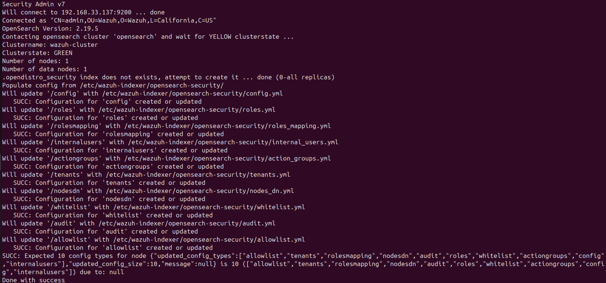

## 6. Cluster Health Check

Verified the indexer cluster status via API:
```bash
curl -k -u admin https://192.168.33.137:9200
curl -k -u admin https://192.168.33.137:9200/_cat/nodes?v
```

Cluster state returned `GREEN`, confirming the indexer was healthy.

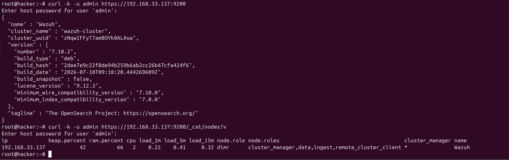

## 7. Wazuh Manager Installation

Installed the Wazuh Manager package:
```bash
apt-get -y install wazuh-manager
```

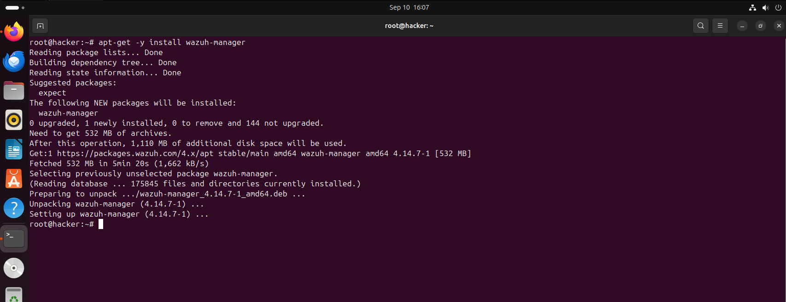

## 8. Manager Configuration (`ossec.conf`)

Configured the `<indexer>` block in `/var/ossec/etc/ossec.conf` to point to the indexer host and Filebeat certificates.

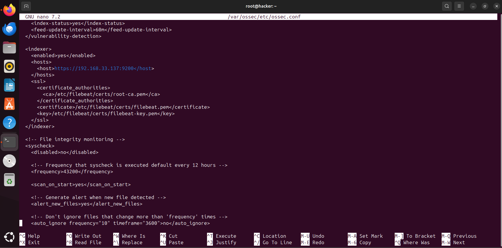

## 9. Dashboard Configuration

Edited `/etc/wazuh-dashboard/opensearch_dashboards.yml` to set the server host, OpenSearch connection, and SSL certificates.

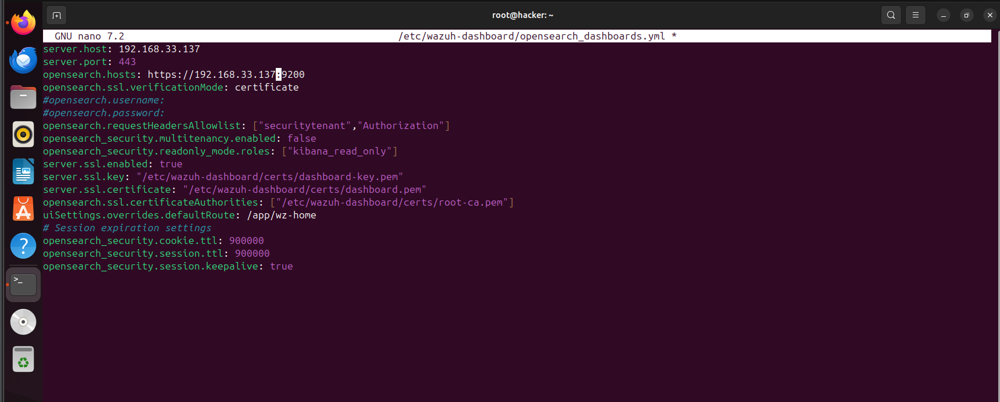

## 10. Dashboard Login

Accessed the Wazuh Dashboard at `https://192.168.33.137` and logged in successfully.

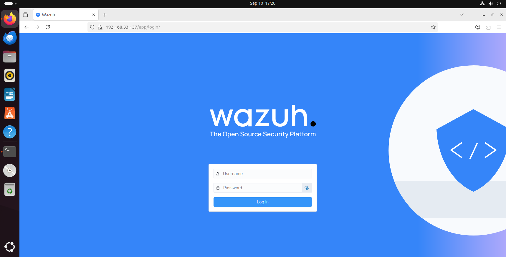

## 11. Dashboard Overview

Confirmed the dashboard was fully operational, showing alert severity summaries.


## 12. Agent Deployment

Used the **Deploy new agent** wizard from the dashboard to generate the installation command for a Linux endpoint.

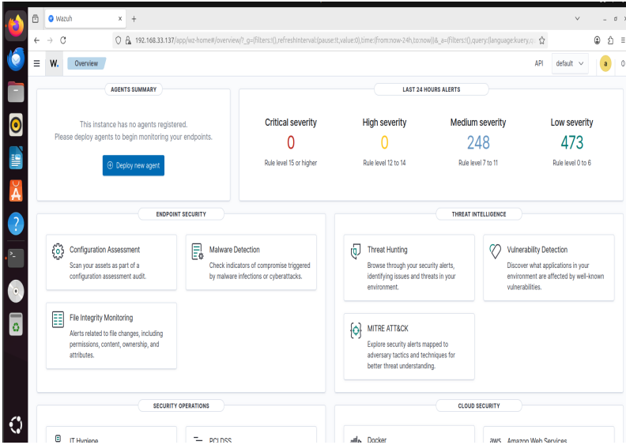

## 13. Agents Verification

Confirmed two agents registered on the manager — one Windows endpoint (disconnected) and one Ubuntu web server (`dvwa-web-server`, active).

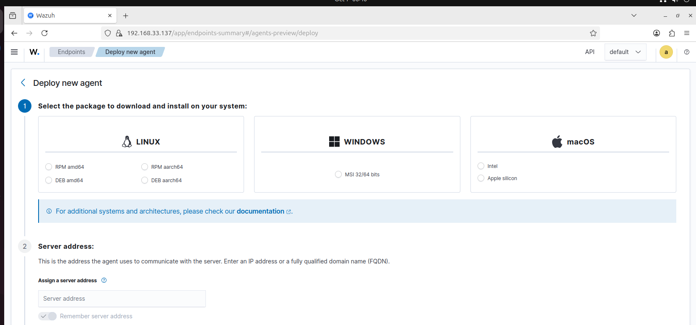

## Notes / Issues Encountered

- Initial `tar -xf` extraction failed due to incorrect file names in the archive (`wazuh.pem` vs `wazuh-1.pem`); resolved by listing archive contents first with `tar -tf` and adjusting the extraction command.
- No major issues with the Wazuh Manager installation.
- Successfully validated indexer cluster health before proceeding with manager and dashboard setup.
