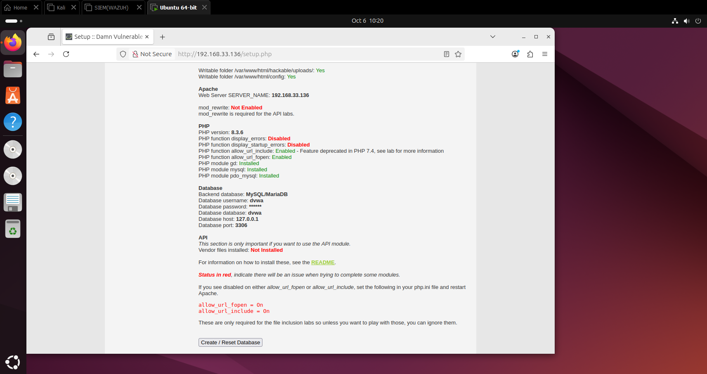
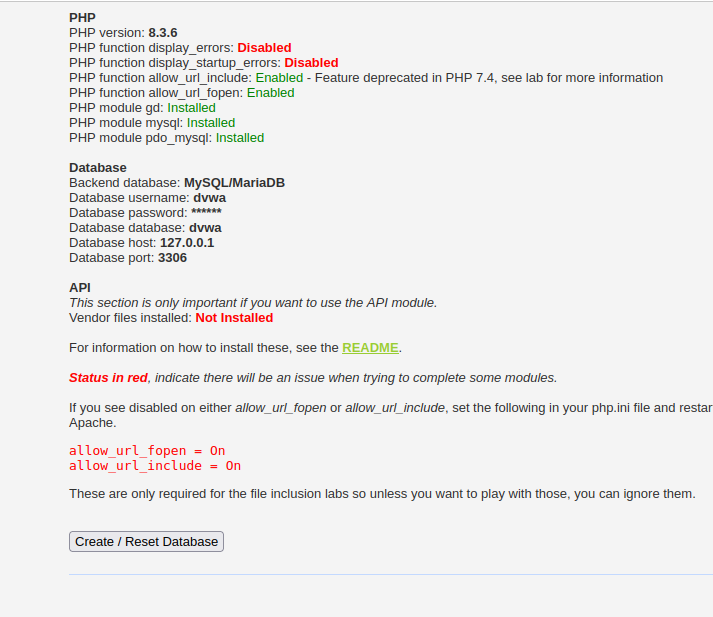
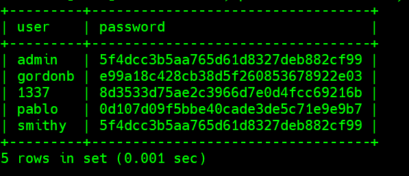
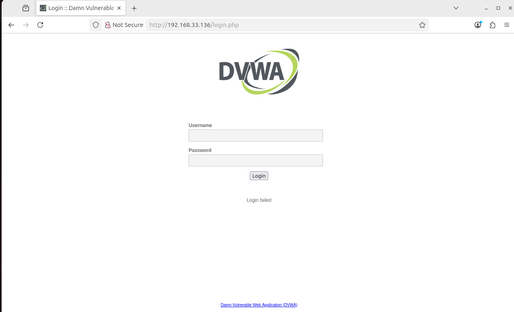
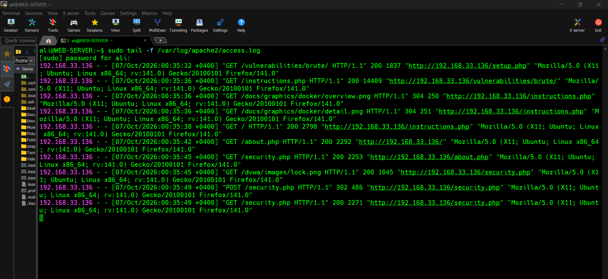
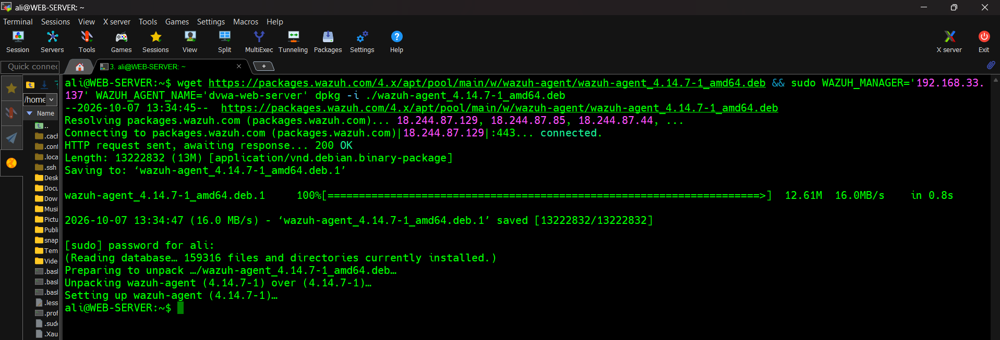
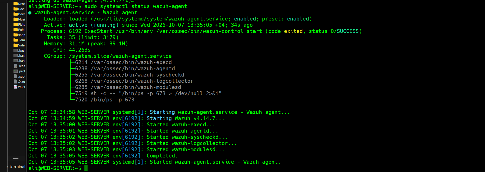
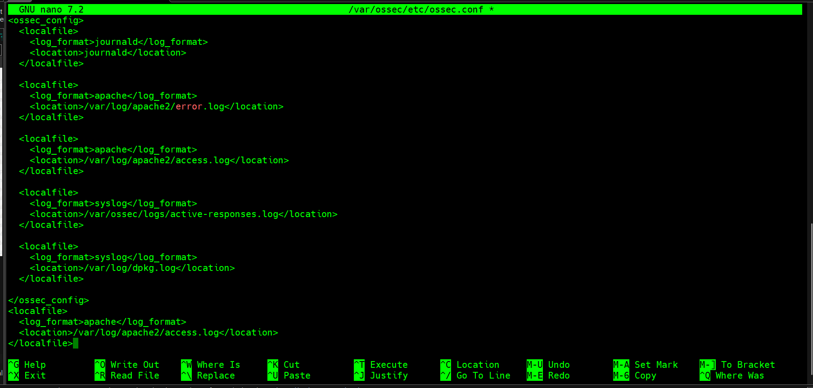
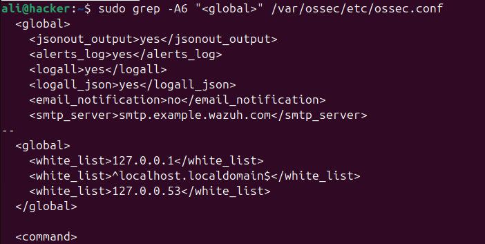

# Web Server & Agent Setup

## Environment
- OS: Ubuntu 24.04.5 LTS
- Web Application: DVWA (Damn Vulnerable Web Application)
- Web Server IP: `192.168.33.136`
- Wazuh Manager IP: `192.168.33.137`

## 1. DVWA Installation

Installed DVWA on the web server with Apache, PHP 8.3.6, and MySQL/MariaDB.



PHP and database configuration were verified from the setup page before initializing the database.



## 2. Database Verification

Confirmed the default DVWA users table was populated after database creation.



## 3. DVWA Login Page

Accessed DVWA at `http://192.168.33.136/login.php`.



## 4. Apache Access Log

Verified that Apache was logging requests to `/var/log/apache2/access.log`, capturing DVWA activity (page requests, POST requests to `security.php`, etc.).

```bash
sudo tail -f /var/log/apache2/access.log
```



## 5. Wazuh Agent Installation

Installed the Wazuh Agent on the web server, pointing it to the Wazuh Manager and naming it `dvwa-web-server`:

```bash
wget https://packages.wazuh.com/4.x/apt/pool/main/w/wazuh-agent/wazuh-agent_4.14.7-1_amd64.deb && sudo WAZUH_MANAGER='192.168.33.137' WAZUH_AGENT_NAME='dvwa-web-server' dpkg -i ./wazuh-agent_4.14.7-1_amd64.deb
```



## 6. Starting the Agent

Started and enabled the agent service:

```bash
sudo systemctl enable wazuh-agent
sudo systemctl start wazuh-agent
sudo systemctl status wazuh-agent
```

Confirmed the agent was active and running, with all core processes (`wazuh-execd`, `wazuh-agentd`, `wazuh-syscheckd`, `wazuh-logcollector`, `wazuh-modulesd`) started successfully.



## 7. Configuring Log Collection (`ossec.conf`)

Added `<localfile>` blocks in `/var/ossec/etc/ossec.conf` to forward Apache access and error logs to the Wazuh Manager.



## 8. Enabling Full Event Logging

Verified the `<global>` block to ensure `logall` and `logall_json` were enabled, so all events (not just alerts) are stored for later analysis.

```bash
sudo grep -A6 "<global>" /var/ossec/etc/ossec.conf
```



## 9. Verification on the Manager

Confirmed on the Wazuh Dashboard (**Endpoints**) that the agent `dvwa-web-server` (`192.168.33.136`) appeared with status **active**.

## Notes / Issues Encountered

- Initial DVWA login attempt failed ("Login failed") before the database was properly initialized via the setup page.
- No issues during agent installation; the one-line install command from the Wazuh Dashboard's "Deploy new agent" wizard worked as expected.
- Confirmed log forwarding was working by cross-checking Apache's local access log against events appearing in the Wazuh Dashboard.
